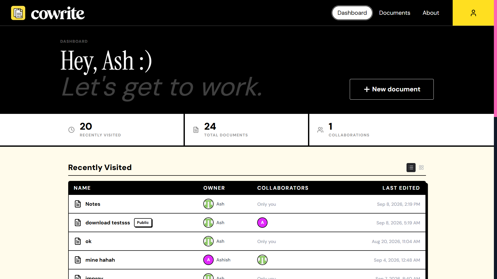
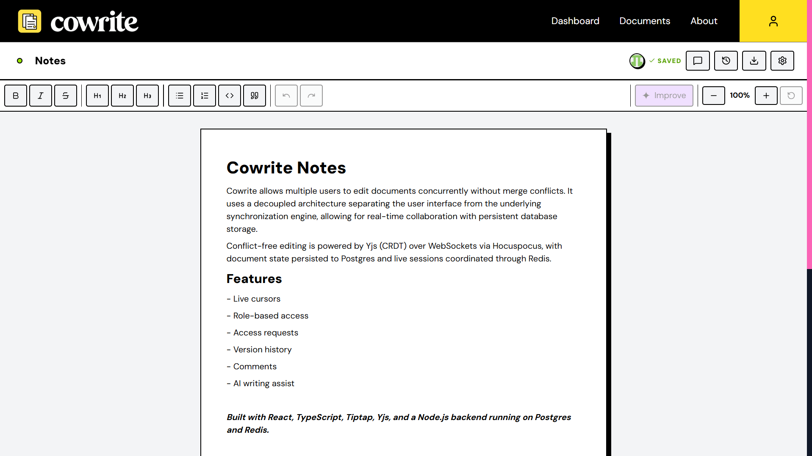
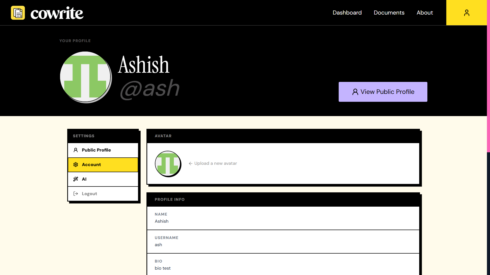
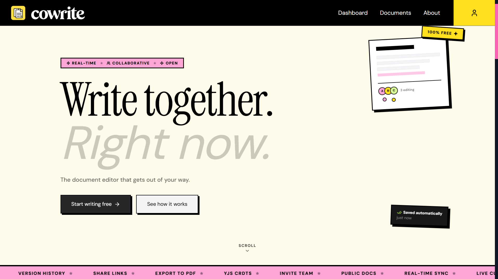

<p align="center">
  
</p>

Cowrite allows multiple users to edit documents concurrently without merge conflicts. It uses a decoupled architecture separating the user interface from the underlying synchronization engine, allowing for real-time collaboration with persistent database storage.

Conflict-free editing is powered by Yjs (CRDT) over WebSockets via Hocuspocus, with document state persisted to Postgres and live sessions coordinated through Redis.

## Stack

**Frontend:** React, TypeScript, Tiptap, Yjs, TailwindCSS  
**Backend:** Node.js, Express, Hocuspocus, Prisma, Playwright  
**Database:** PostgreSQL  
**Cache:** Redis  
**Storage:** Cloudinary  
**AI:** Gemini API

## Features

- Real-time collaborative editing with live cursors
- Role-based access (Owner, Editor, Viewer, Anonymous)
- Users can request access to a private document, owners approve or deny
- Version history with change summaries
- Comments and annotations
- AI-powered writing improvement, using a shared server key or a user-supplied Gemini API key
- Export to PDF and DOCX
- Public/private documents with shareable, role-scoped invite links
- Recently viewed documents, tracked per user
- JWT authentication with Redis-backed token blacklisting
- Rate limiting on auth, AI, search and export endpoints

## Screenshots

<table>
  <tr>
    <td width="50%">
        <p align="center">
            <sub>Dashboard</sub>
        </p>
    </td>
    <td width="50%">
        <p align="center">
            <sub>Collaborative editor</sub>
        </p>
    </td>
  </tr>

  <tr>
    <td width="50%">
        <p align="center">
            <sub>Account settings</sub>
        </p>
    </td>
    <td width="50%">
        <p align="center">
            <sub>Landing page</sub>
        </p>
    </td>
  </tr>
</table>

## Local Development

### Prerequisites

- Docker Desktop

### Setup

```bash
git clone https://github.com/Ashish-Kumar-Vaish/Cowrite.git
cd Cowrite

cp client/.env.example client/.env
cp server/.env.example server/.env
# fill in the values in both .env files

docker compose up --build
# or use -d for detached mode

docker compose exec server npx prisma migrate dev
```

- Client: `http://localhost:5173`
- API: `http://localhost:3000`
- WebSocket collaboration: `ws://localhost:1234`

`--build` and migrations are only needed on first run or after changing dependencies/schema, plain `docker compose up` or `docker compose up -d` covers everyday restarts.

### Testing

Tests run against Postgres and Redis directly (not inside Docker), using `server/.env.test`. The compose file exposes Postgres on host port `5433`, so with the stack running:

```bash
cd server
createdb -h localhost -p 5433 -U postgres Cowrite_test
npm test
```

Migrations are applied automatically before the suite runs. 209 tests across 10 files. Export (PDF/DOCX) and avatar upload are not covered, since they require a real Playwright browser install and real Cloudinary credentials respectively.

The suite logs every rejected request at `WARN`/`ERROR` level (403s, 409s, a 400 from Gemini rejecting the test's placeholder API key). That's expected and those are the negative-path tests asserting access control and error handling actually work, not failures. Look at the final `Test Files` / `Tests` summary line, not the log noise above it.

A Yjs performance benchmark is also available:

```bash
npm run benchmark
```

Expect 50-client concurrent merges to be noticeably slower (~2-3 ops/sec, hundreds of ms) than single inserts (thousands of ops/sec), that's the CRDT merge cost scaling with concurrent client count, not a regression.

## Environment Variables

### Server

| Variable                | Description                  |
| ----------------------- | ---------------------------- |
| `PORT`                  | HTTP API port                |
| `WS_PORT`               | WebSocket collaboration port |
| `DATABASE_URL`          | PostgreSQL connection string |
| `REDIS_HOST`            | Redis host                   |
| `REDIS_PORT`            | Redis port                   |
| `REDIS_PASSWORD`        | Redis password               |
| `JWT_SECRET`            | Min 32 characters            |
| `JWT_EXPIRES_IN`        | Token expiry e.g. `7d`       |
| `FRONTEND_URL`          | Client URL for CORS          |
| `CLOUDINARY_CLOUD_NAME` | Cloudinary cloud name        |
| `CLOUDINARY_API_KEY`    | Cloudinary API key           |
| `CLOUDINARY_API_SECRET` | Cloudinary API secret        |
| `GEMINI_API_KEY`        | Google Gemini API key        |

### Client

| Variable           | Description             |
| ------------------ | ----------------------- |
| `VITE_BACKEND_URL` | Backend Node server URL |
| `VITE_WS_URL`      | WebSocket server URL    |

## Known Tradeoffs

- Account deletion cascades owned documents with no collaborator warning, currently avoids orphaned documents with no owner.
- Rate limiting fails open if Redis is down, it avoids blocking all traffic during a Redis outage.
- AI requests fall back to a shared server API key with no per-user cost cap, keeps AI usable without requiring every user to bring their own key.
- Rate limiting uses fixed windows, allowing ~2x burst at window boundaries.
- User lookup by email can reveal whether an account exists. This is inherent to the global collaborator invite search, and the risk is mitigated through rate limiting.

## Future Improvements / TODOs

- No forgot-password flow, requires an email provider.
- Gemini API key stored in plaintext, not encrypted at rest.
- CRDT state and version snapshots grow unboundedly over long edit history.
- JWT stored in localStorage, not in an httpOnly cookie. Refresh tokens feature is not implemented.
- Implement OAuth login flow, allowing users to sign in with Google, GitHub, etc.
- Add more toolbar buttons, like align left/right, insert table, etc.
- Ts lwk takes so much time and refactoring, so I'll probably just procrastinate on all of this.
- Add more AI features, like summarization, grammar correction, etc.
- Code things for my personal projects that will never see the light of day.
- Add more UI components, like a live chat feature, a file upload feature, etc.
- Create dark theme toggle, bookmarks, favorites, folders, etc.
- Add edit/update comment in UI, api exists already.
- Add tooltips to various UI elements like truncating text, toolbar buttons, etc.
- Add aria labels properly.

## Contributing

Contributions are welcome! Please open an issue or submit a pull request.
